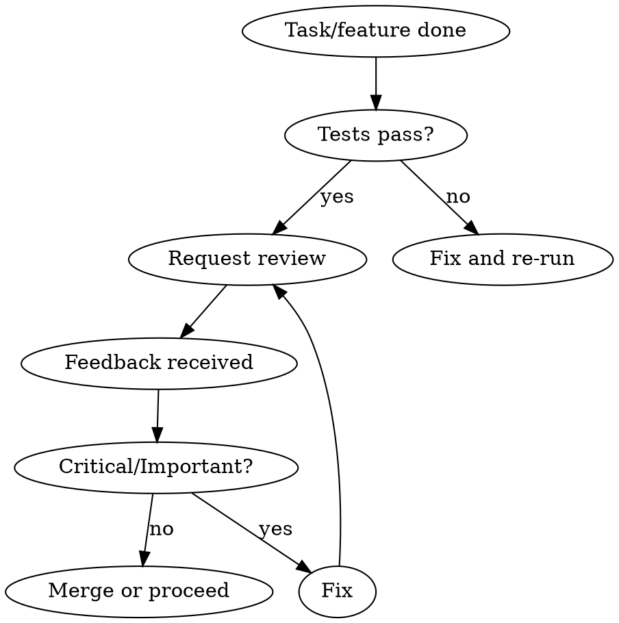

# Code Review Workflow

## Overview

Review is a gate before merge: decide when it is required, run it with clear context, then fix or respond to feedback. Prevents "skip review" and "merge with open Critical/Important issues."

**Core principle:** Review the work product against plan/spec and quality; fix Critical and Important issues before merge.

## When to Use

- After completing a task (in task-by-task workflows)
- After implementing a major feature
- Before merging to main or a shared branch
- When asked to review someone else's change

**When NOT to use:** Trivial typo/config-only change with no behavior impact, or when human explicitly says "no review."

## Workflow

1. **Gate** — Tests must pass before requesting review. Run the test suite; fix failures first.
2. **Request review** — Dispatch reviewer with clear context: what was implemented, plan/requirements, commit range. Use requesting-code-review skill if available (e.g. code-reviewer subagent).
3. **Triage feedback** — Critical: fix before any merge. Important: fix before proceeding. Minor: fix or log for later.
4. **Respond** — Fix issues or push back with reasoning. Do not merge with open Critical or Important items unless reviewer agrees.

## Quick Reference

| Step     | Do                                      | Do not                                |
|----------|-----------------------------------------|----------------------------------------|
| Before review | Run tests, ensure they pass             | Request review with failing tests     |
| Request  | Provide plan/spec, commit range, summary | Send only diff or vague description   |
| Feedback | Fix Critical and Important first       | Merge ignoring Critical/Important     |
| Disagree | Explain with evidence, ask for re-check | Silently ignore or merge anyway       |

## Rationalization Table

| Excuse | Reality |
|--------|--------|
| "Change is too small to review" | Small changes still can have bugs or spec drift. Quick review is cheap. |
| "I'll get review after everything" | Review per task catches issues early; one big review at the end is harder. |
| "Review is only for style" | Review must check spec compliance and correctness first; style is secondary. |
| "Minor issues can wait" | Critical and Important cannot wait. Minor can be logged. |

## Red Flags — STOP

- Requesting review while tests are failing
- Merging with unresolved Critical or Important feedback (without reviewer agreement)
- "No need to review" for non-trivial changes
- Reviewing only formatting and ignoring behavior/spec

**Any of these:** Run tests, request or re-request review, fix blocking issues before merge.

## Common Mistakes

- **Reviewing without plan/spec** — Reviewer needs "what it should do" to judge correctness.
- **Skipping review to save time** — Bugs found in review are cheaper than in production.
- **Treating all feedback as optional** — Critical and Important are mandatory unless reviewer is wrong (explain and get agreement).

## Integration

- **Requesting review:** superpowers:requesting-code-review (and code-reviewer subagent if available).
- **After review:** Fix issues, then superpowers:finishing-a-development-branch for merge/PR options.
