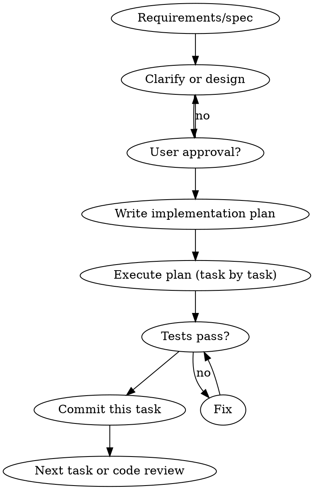

# Feature Development Workflow

## Overview

One consistent sequence before and during implementation: clarify/design → plan → implement with tests → small commits. Prevents "code first, fix later" and "one big commit."

**Core principle:** No implementation code before design and plan are agreed; no commit without passing verification.

## When to Use

- New feature from PRD, issue, or verbal request
- Scope is more than a single-file trivial change
- You are about to write production code

**When NOT to use:** One-line config change, typo fix, or dependency bump with no behavior change.

## Workflow

1. **Clarify or design** — If spec is missing or vague, use brainstorming (or equivalent): one question at a time, then present design and get approval. Do not start coding on unapproved scope.
2. **Plan** — Write an implementation plan (steps, files, tests). Use writing-plans skill if available.
3. **Execute** — One task at a time: implement, run tests, commit. Use executing-plans or subagent-driven-development if available.
4. **Review** — Before merge, request code review (requesting-code-review skill if available). Fix Critical/Important issues.

## Quick Reference

| Step        | Do                                         | Do not                          |
|------------|---------------------------------------------|---------------------------------|
| Before code | Design/spec agreed, plan written            | Code first, "design later"      |
| Implement   | Tests for new behavior, run before commit   | "Tests after", skip verification |
| Commit      | One logical change per commit, message clear | One big commit at the end      |
| Before merge| Code review, tests pass                    | Merge without review            |

## Rationalization Table

| Excuse | Reality |
|--------|---------|
| "Too simple to need design" | Simple scope is where wrong assumptions waste the most work. Short design still needs approval. |
| "I'll add tests later" | Later often never happens. Tests define expected behavior; write or run them before commit. |
| "One commit is easier" | Small commits make review and revert possible. Plan says "commit" per task—do it. |
| "Requirements are clear enough" | If you can't write a short plan, scope isn't clear. Write plan, then code. |

## Red Flags — STOP

- Writing production code before design/plan is approved
- "I'll add tests after this change"
- Pushing one large commit for multiple logical changes
- Merging without running tests or without code review

**Any of these:** Pause. Align with the workflow (design → plan → implement with tests → commit → review).

## Common Mistakes

- **Skipping design for "small" features** — Still document and get approval; keep it short.
- **Implementing without a plan** — Leads to rework; write steps and files first.
- **Committing without running tests** — Failing tests must be fixed before commit.

## Integration

- **Before implementation:** superpowers:brainstorming (if scope unclear), superpowers:writing-plans (to produce the plan).
- **During implementation:** superpowers:executing-plans or superpowers:subagent-driven-development.
- **Before merge:** superpowers:requesting-code-review, superpowers:finishing-a-development-branch.
